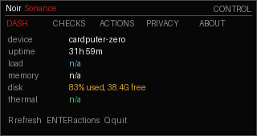
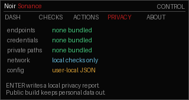

# Control Center

Privacy-safe local dashboard for Cardputer Zero.

Control Center is a compact local dashboard for checking device status from the Cardputer Zero screen or a normal Linux desktop. It focuses on useful system information, simple actions, and privacy-conscious defaults.

Features:

- Device, uptime, load, memory, and disk overview.
- Small-screen dashboard for Cardputer Zero.
- Desktop mode for Raspberry Pi HDMI and regular Linux sessions.
- Privacy page describing what the packaged build does and does not include.

## Screenshots




## Install

Use the install helper:

```bash
curl -fsSL https://raw.githubusercontent.com/rimedag/control_center_cardputerzero/main/install.sh | sh
```

Or download the package for your machine:

```bash
ARCH="$(dpkg --print-architecture)"
curl -LO "https://raw.githubusercontent.com/rimedag/control_center_cardputerzero/main/pool/main/n/noirsonance-control-center/noirsonance-control-center_0.1.0-noirsonance2_${ARCH}.deb"
sudo apt install "./noirsonance-control-center_0.1.0-noirsonance2_${ARCH}.deb"
```

## Launch

Cardputer Zero / small display:

```bash
noirsonance-control-center-cardputerzero
```

Regular Linux desktop or Raspberry Pi HDMI desktop:

```bash
noirsonance-control-center-desktop
```

Automatic mode:

```bash
noirsonance-control-center
```

## Packages

Public downloads are architecture-specific binary builds:

- `amd64` for regular Linux desktops and laptops.
- `arm64` for Cardputer Zero and 64-bit Raspberry Pi OS.

The packaged build uses local-only status checks and does not require cloud accounts, telemetry, or bundled credentials.
